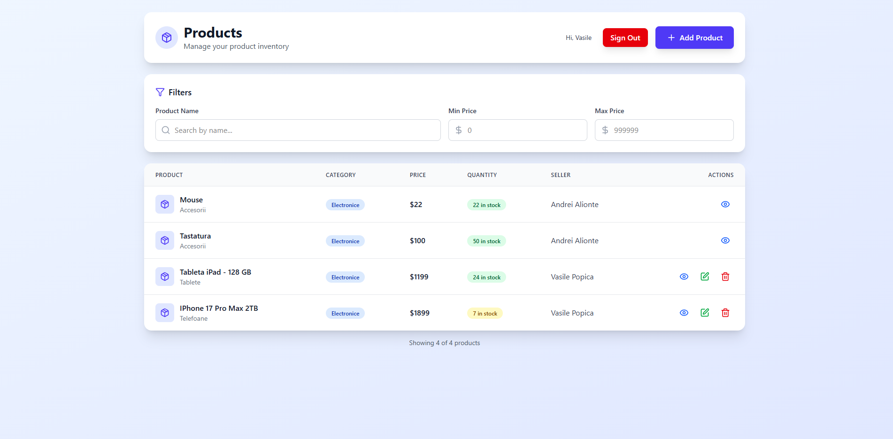
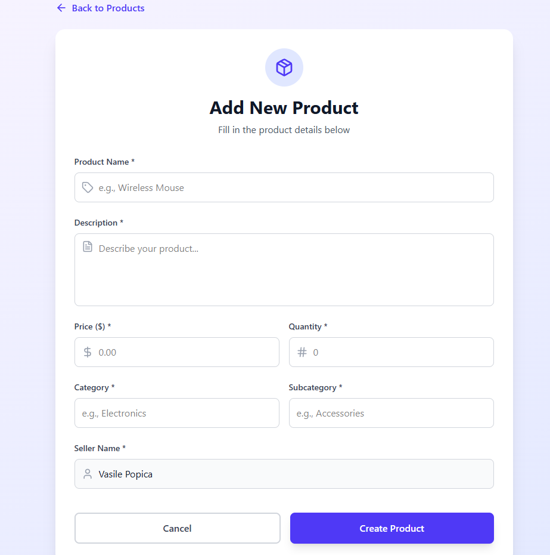

**Project**: MagOnline — Frontend

- **Purpose**: React + TypeScript frontend for the MagOnline sample store. Connects to a Spring Boot backend (JWT auth) to list, view, create, edit, and delete products.

**Prerequisites**:
- **Node.js**: v16+ recommended.
- **Package manager**: `pnpm` recommended (project includes `pnpm-lock.yaml`), or `npm` as fallback.
- **Backend**: Running instance of the MagOnline backend (see backend README). By default the frontend expects the backend at `http://localhost:5000`.

**Quick Start (pwsh / PowerShell)**
- Install dependencies: `pnpm install` (or `npm install`).
- Run dev server: `pnpm dev` (or `npm run dev`).
- Build for production: `pnpm build` (or `npm run build`).
- Preview production build: `pnpm preview` (or `npm run preview`).

**Configuration**
- API base and endpoint paths live in `src/utils/api.config.ts`.
  - Default: `BASE_URL = "http://localhost:5000/api/"`.
  - If your backend runs on another host/port, update that file.

**Auth flow (frontend expectations)**
- Login response expected: `{ token, user }` where `user` contains `id`, `firstName`, `lastName`, `email`.
- The frontend stores `token` and `user` in `localStorage` after login. Protected actions (create, edit, delete) check `localStorage.user`.

**Important Frontend behavior & recent changes**
- Fixed product details fetch to use query parameter: `/api/products/getproduct?id={id}` (backend expects `?id=`).
- Product model now includes `sellerId` and `description` (`src/core/model/Product.ts`). Frontend uses `sellerId` to verify ownership.
- New product creation auto-fills seller name from the logged-in user and includes `sellerId` in the payload.
- Edit/Delete actions are guarded on the client: only the product owner (matching `sellerId`, or fallback matching `sellerName`) may edit/delete. The product details view is public.
- If a protected action is attempted while not logged in, the UI redirects to `/login`.
- A bulk removal of in-source comments was performed in several UI files to clean up code.

**Backend compatibility notes / Recommendations**
- The frontend relies on the backend to persist and return `sellerId` for reliable ownership checks. If you see incorrect authorization behavior, ensure the backend:
  - Sets `sellerId` on product creation and returns it in product DTOs.
  - Enforces server-side authorization on update/delete endpoints (client-side checks are not sufficient for security).
- Ensure CORS is configured on the backend to allow the frontend origin during development.

**Troubleshooting**
- 404 when opening product details: verify the frontend is calling `getproduct?id={id}` and that the backend is running and reachable at the `BASE_URL` in `src/utils/api.config.ts`.
- Ownership/authorization errors: confirm backend returns `sellerId` and that `localStorage.user.id` matches backend user ids.
- If login doesn't persist: check browser storage and ensure backend login returns `user` and `token` as described.

**Key files**
- `src/utils/api.config.ts` — API base and endpoints
- `src/core/model/Product.ts` — Product TypeScript interface
- `src/pages/Products/AllProducts/AllProducts.tsx` — list, add, edit, delete UI
- `src/pages/Products/ProductDetails/ProductDetails.tsx` — product detail view
- `src/pages/Products/NewProduct/NewProduct.tsx` — create product page
- `src/pages/Products/EditProduct/EditProduct.tsx` — edit product page
- `src/pages/Login/Login..tsx` and `src/pages/Register/Register.tsx` — auth UI

## Screenshots

Below are a couple of screenshots included with this repository. If you want to replace them with higher-resolution images, put your images in the `phts-readme/` folder and update the filenames accordingly.

- **All Products list**
- **Add New Product**

  

    <strong>All Products list</strong>
    

      
    

  

  

    <strong>Add New Product</strong>
    

      
    

  

